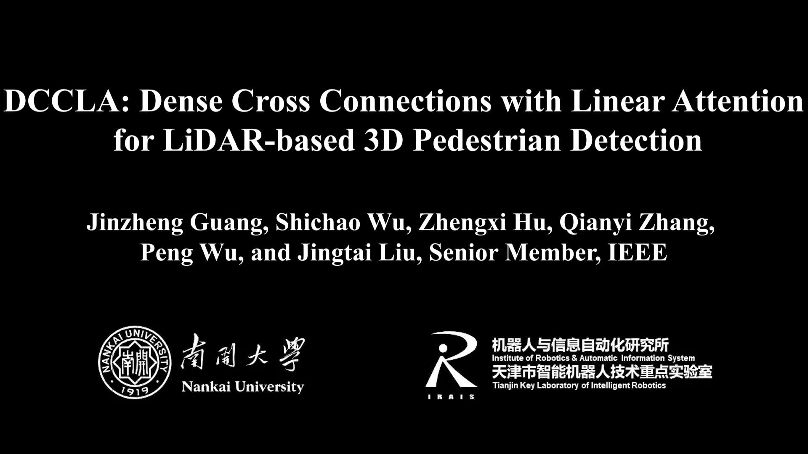

# DCCLA

Official PyTorch implementation of [DCCLA: Dense Cross Connections with Linear Attention for LiDAR-based 3D Pedestrian Detection](https://doi.org/10.1109/TCSVT.2024.3515996)

[](https://youtu.be/kZknf9NtbIg "")

## News

- **(2024-12-16)** 🔥 We release the code and model of DCCLA.
- **(2024-12-12)** 🔥 DCCLA is accepted by [TCSVT](https://doi.org/10.1109/TCSVT.2024.3515996). 
- **(2023-11-23)** 🏆 DCCLA ranks first on [JRDB 2022 3D Pedestrian Detection](https://jrdb.erc.monash.edu/leaderboards/detection22) Leaderboard.

- **(2023-11-23)** 🏆 DCCLA ranks first on [JRDB 2019 3D Pedestrian Detection](https://jrdb.erc.monash.edu/leaderboards/detection) Leaderboard.


## 3D Pedestrian Detection Results

### JRDB validation set

|            Dataset             | AP@0.3  | AP@0.5  | AP@0.7 |                                             Checkpoint                                              |
|:----------------------------:|:-------:|:-------:|:------:|:---------------------------------------------------------------------------------------------------:|
| [JRDB 2022](bin/jrdb22.yaml) | 71.662% | 43.288% | 6.067% | [DCCLA_JRDB2022.pth](https://github.com/jinzhengguang/DCCLA/releases/download/v1.0/DCCLA_JRDB2022.pth) |
| [JRDB 2019](bin/jrdb19.yaml) | 73.613% | 44.938% | 6.014% | [DCCLA_JRDB2019.pth](https://github.com/jinzhengguang/DCCLA/releases/download/v1.0/DCCLA_JRDB2019.pth) |


### JRDB Leaderboard


|            Dataset             | OSPA@IoU | AP@0.3 | AP@0.5  | AP@0.7 | 
|:----------------------------:|:--------:|:------:|:-------:|:------:|
| [JRDB 2022](https://jrdb.erc.monash.edu/leaderboards/detection22) |  0.711   |76.753% | 48.134% | 7.305% |
| [JRDB 2019](https://jrdb.erc.monash.edu/leaderboards/detection) | 0.557    |76.282% | 47.436% | 7.053% |


## Requirements

- `python==3.9`
- `PyTorch==1.13.1`
- `cuda==11.6`
- `torchsparse==1.2.0` [(link)](https://github.com/mit-han-lab/torchsparse)

```shell
python setup.py develop
cd lib/iou3d
python setup.py develop
cd ../jrdb_det3d_eval
python setup.py develop
```


## JRDB dataset

Download [JRDB dataset](https://jrdb.erc.monash.edu/) under `PROJECT/data`.


```shell
# convert_labels_to_KITTI
python lib/jrdb_devkit/detection_eval/convert_labels_to_KITTI.py
# train
python bin/train.py --cfg bin/jrdb19.yaml
# validation
python bin/train.py --cfg bin/jrdb19.yaml --ckpt DCCLA_JRDB2019.pth --evaluation
```


## Citation

```
@article{guang2024dccla,
  title={DCCLA: Dense Cross Connections with Linear Attention for LiDAR-based 3D Pedestrian Detection},
  author={Guang, Jinzheng and Wu, Shichao and Hu, Zhengxi and Zhang, Qianyi and Wu, Peng and Liu, Jingtai},
  journal={IEEE Transactions on Circuits and Systems for Video Technology},
  year={2024},
  publisher={IEEE}
}
```

## Acknowledgement

- RPEA [(link)](https://github.com/jinzhengguang/RPEA)
- Person_MinkUNet [(link)](https://github.com/VisualComputingInstitute/Person_MinkUNet)
- PiFeNet [(link)](https://github.com/ldtho/PiFeNet)
- torchsparse [(link)](https://github.com/mit-han-lab/torchsparse)
- PointRCNN [(link)](https://github.com/sshaoshuai/PointRCNN)
