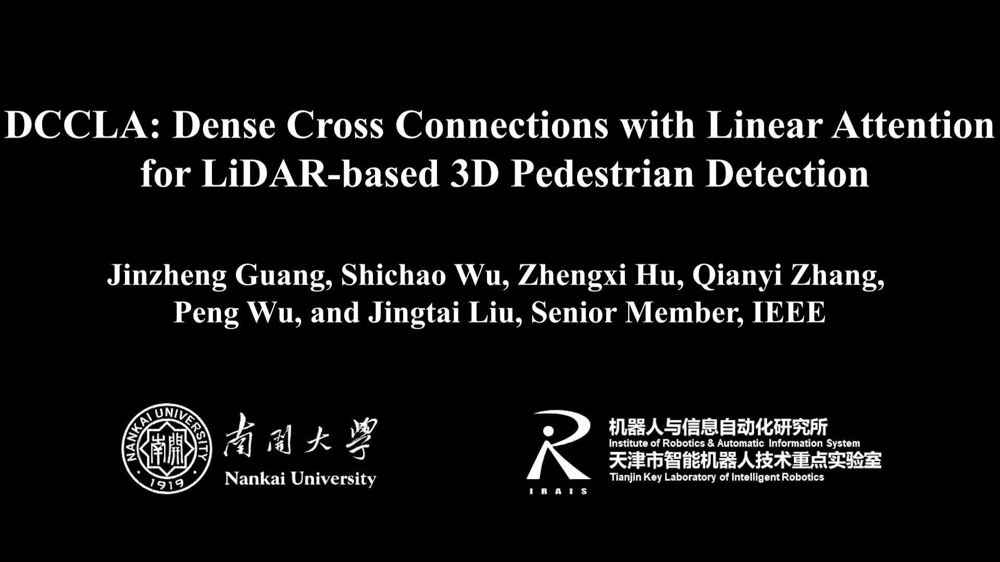
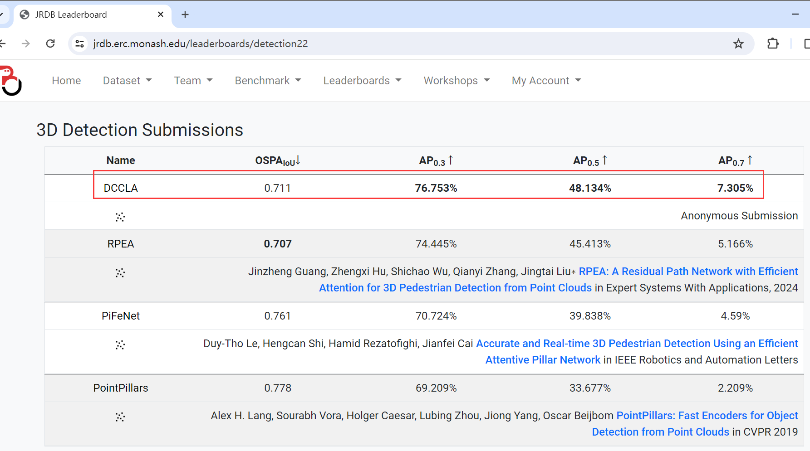
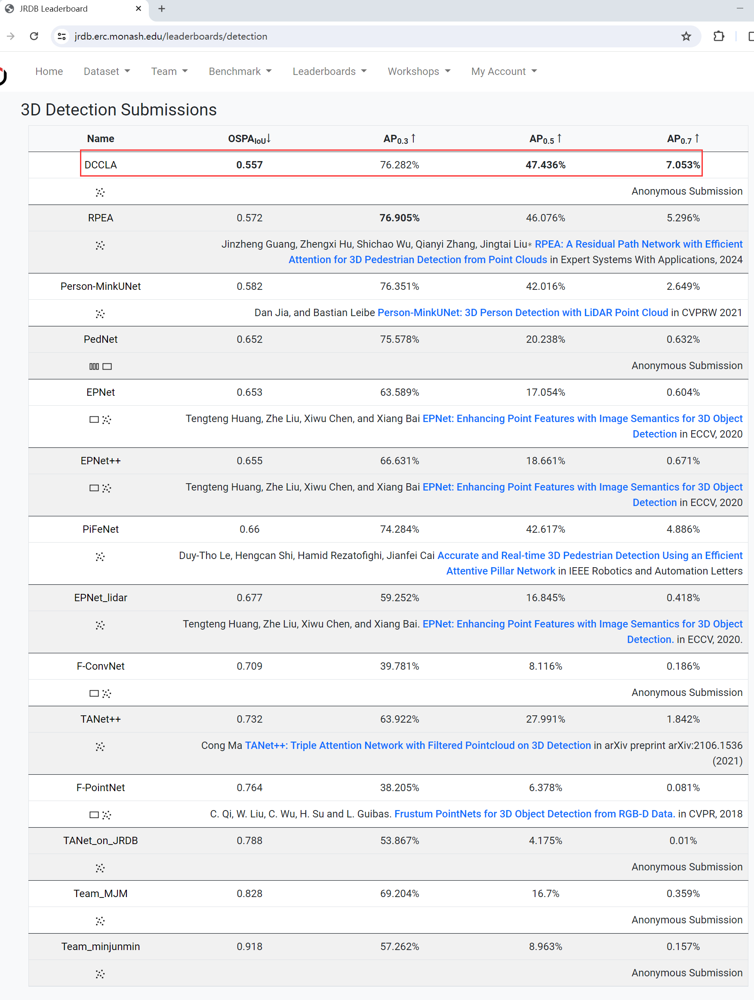

# DCCLA

Official PyTorch implementation of DCCLA: Dense Cross Connections with Linear Attention for LiDAR-based 3D Pedestrian Detection.

## 3D Detection Results

### Comparison with state-of-the-art methods

Our DCCLA ranks first on [JRDB 2022](https://jrdb.erc.monash.edu/leaderboards/detection22) and [JRDB 2019](https://jrdb.erc.monash.edu/leaderboards/detection) 3D pedestrian detection leaderboards.

|           Model           | mAP (JRDB 2022) | mAP (JRDB 2019) | 
|:-------------------------:|:---------------:|:---------------:|
| [RPEA](https://github.com/jinzhengguang/RPEA)   |     45.413%     |     46.076%     | 
|           DCCLA           |     48.134%     |     47.436%     | 
|        Improvement        |     +2.721%     |     +1.360%     | 

### Comparison with benchmark method

Our DCCLA improves the mAP by 9.7% over the benchmark method.

|                             Datasets                                    | AP@0.3 | AP@0.5 | AP@0.7  | 
|:-----------------------------------------------------------------------:|:------:|:------:|:-------:|
| [Baseline](https://github.com/VisualComputingInstitute/Person_MinkUNet) | 71.23% | 35.29% |  2.00%  |
|                                  DCCLA                                  | 73.61% | 44.94% |  6.01%  |
|                               Improvement                               | +2.39% | +9.65% | +4.01%  |

## News

- **(2024-xx-xx)** 🔥 We will release the code and model after the paper is accepted.
- **(2023-11-23)** 🏆 DCCLA ranks first on [JRDB 2022 3D Pedestrian Detection Leaderboard](https://jrdb.erc.monash.edu/leaderboards/detection22).

- **(2023-11-23)** 🏆 DCCLA ranks first on [JRDB 2019 3D Pedestrian Detection Leaderboard](https://jrdb.erc.monash.edu/leaderboards/detection).

## Acknowledgement

- RPEA [(link)](https://github.com/jinzhengguang/RPEA)
- Person_MinkUNet [(link)](https://github.com/VisualComputingInstitute/Person_MinkUNet)
- PiFeNet [(link)](https://github.com/ldtho/PiFeNet)
- torchsparse [(link)](https://github.com/mit-han-lab/torchsparse)
- PointRCNN [(link)](https://github.com/sshaoshuai/PointRCNN)

## Contact Information

If you have any suggestion or question, you can leave a message here or contact us directly: guangjinzheng@qq.com. Thanks for your attention!

